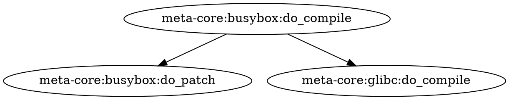

# Query Interface Design for Bitzel

Inspired by Bazel's query, cquery, and aquery commands.

## Overview

Bazel provides three distinct query commands that operate at different build phases, each offering unique visibility into the build:

| Command | Phase | Purpose | Key Use Cases |
|---------|-------|---------|---------------|
| **query** | Loading | Theoretical structure | Fast dependency queries, overapproximates select() |
| **cquery** | Analysis | Configured targets | Precise dependencies with build flags and overrides |
| **aquery** | Execution | Actions & artifacts | Inspect actual commands, inputs/outputs |

## Why Bazel's Query System is Powerful

### 1. **Multi-Phase Visibility**
- Different commands for different build phases
- Each phase provides appropriate level of detail
- No single tool tries to do everything

### 2. **Rich Output Formats**
- **Text**: Human-readable (default)
- **Proto/JSON**: Machine-readable for tooling
- **Graph**: Visual dependency graphs (GraphViz .dot)
- **Files**: List output artifacts
- **Starlark**: Custom formatting with full provider access
- **Commands**: Actual build commands executed

### 3. **Powerful Query Functions**
- `deps(target)` - Show all dependencies
- `rdeps(universe, target)` - Reverse dependencies (what depends on this)
- `somepath(from, to)` - Find a dependency path
- `allpaths(from, to)` - Find all dependency paths
- `kind(pattern, expr)` - Filter by rule/task type
- `filter(pattern, expr)` - Filter by label pattern
- `inputs(pattern, expr)` - Filter by input files (aquery)
- `outputs(pattern, expr)` - Filter by output files (aquery)
- `mnemonic(pattern, expr)` - Filter by action type (aquery)

### 4. **Composability**
- Functions can be nested and combined
- Set operations: `intersect`, `union`, `except`
- Enable complex queries like "all tests that depend on library X"

### 5. **Build Flag Awareness**
- `cquery` respects build flags and configurations
- Shows exact dependency paths based on overrides (MACHINE, DISTRO)
- Critical for understanding conditional compilation

### 6. **Debugging Support**
- `aquery_differ` compares action graphs before/after changes
- `--skyframe_state` queries cached results without re-analysis
- Profile integration to link actions with timing data

## Applying to Bitzel

### Current Bitzel Capabilities

Bitzel already has the building blocks:

1. **Recipe Graph** - Like Bazel's loading phase
   - Shows recipe dependencies (DEPENDS)
   - Available after recipe parsing

2. **Task Execution Graph** - Like Bazel's analysis phase
   - Shows task-level dependencies (do_compile depends on do_patch)
   - Includes override resolution (MACHINE, DISTRO)
   - Task signatures (content-addressable hashing)

3. **Execution Logs** - Like Bazel's execution phase
   - Captures stdout/stderr
   - Error categorization
   - Output artifact tracking

4. **Signature Cache** - Build cache with invalidation
   - Hash-based change detection
   - Transitive dependency propagation

### Proposed Query Commands for Bitzel

#### 1. `bitzel query` - Recipe Graph Queries

Query the recipe dependency graph (fast, operates on parsed recipes).

**Examples:**
```bash
# Show all recipes
bitzel query //...

# Find what busybox depends on
bitzel query "deps(meta-core:busybox)"

# Find what depends on glibc (reverse dependencies)
bitzel query "rdeps(meta-core:glibc)"

# Find dependency path
bitzel query "somepath(meta-core:busybox, meta-core:glibc)"

# Filter by recipe type
bitzel query "kind('class_image', meta-core:...)"

# Output as graph
bitzel query "deps(meta-core:busybox)" --output=graph > deps.dot
dot -Tpng deps.dot -o deps.png
```

#### 2. `bitzel cquery` - Configured Task Queries

Query the task execution graph with MACHINE/DISTRO overrides applied.

**Examples:**
```bash
# Show tasks for busybox with raspberrypi4-64 machine
bitzel cquery "meta-core:busybox:do_compile" --machine=raspberrypi4-64

# Find all tasks that depend on glibc:do_compile
bitzel cquery "rdeps(meta-core:glibc:do_compile)" --machine=qemux86-64

# Show task dependencies with different distros
bitzel cquery "deps(meta-core:busybox:do_compile)" --distro=poky

# Compare task signatures across configurations
bitzel cquery "meta-core:busybox:*" --machine=raspberrypi4-64 --output=signatures

# Find which tasks will rebuild after a recipe change
bitzel cquery "affected(meta-core:busybox)" --show-invalidated
```

#### 3. `bitzel aquery` - Action/Execution Queries

Query actual task execution details, logs, and artifacts.

**Examples:**
```bash
# Show execution log for a task
bitzel aquery "meta-core:busybox:do_compile"

# Show task command that would be executed
bitzel aquery "meta-core:busybox:do_compile" --output=command

# Find tasks that produced specific outputs
bitzel aquery "outputs('busybox$')"

# Show tasks that failed in last build
bitzel aquery --failed

# Show execution metrics (duration, cache hits)
bitzel aquery "meta-core:busybox:*" --output=metrics

# Export logs as JSON
bitzel aquery "meta-core:busybox:do_compile" --output=json
```

#### 4. `bitzel cache` - Cache Management Queries

Query and manage the build cache (similar to `bazel clean`).

**Examples:**
```bash
# Show cache statistics
bitzel cache stats

# Show what's cached for a recipe
bitzel cache query "meta-core:busybox"

# Show cache size and hit rates
bitzel cache info

# Clean cache entries older than 30 days
bitzel cache clean --older-than=30d

# Invalidate cache for specific task
bitzel cache invalidate "meta-core:busybox:do_compile"

# Show cache dependency tree
bitzel cache tree "meta-core:busybox:do_compile"
```

## Output Format Design

### Text Format (Default)
```
meta-core:busybox:do_compile (a4f3e21)
  depends on:
    meta-core:busybox:do_patch (b2d4f11)
    meta-core:glibc:do_compile (c3e5a22)
```

### JSON Format
```json
{
  "target": "meta-core:busybox:do_compile",
  "signature": "a4f3e2156b8c...",
  "dependencies": [
    {
      "target": "meta-core:busybox:do_patch",
      "signature": "b2d4f11a3c9..."
    }
  ],
  "outputs": ["/work/outputs/busybox"],
  "cached": true,
  "last_execution": {
    "duration_ms": 1234,
    "exit_code": 0,
    "timestamp": "2025-11-14T08:00:00Z"
  }
}
```

### Graph Format (GraphViz)


### Starlark Format (Custom)
```bash
bitzel query "deps(meta-core:busybox)" --output=starlark \
  --starlark-expr="[t.recipe + ':' + t.task for t in targets]"
```

## Implementation Plan

### Phase 1: Core Query Engine (Immediate)

1. **Query Parser**
   - Parse query expressions: `deps()`, `rdeps()`, `somepath()`, etc.
   - Support nesting and composition
   - Set operations: `intersect`, `union`, `except`

2. **Graph Traversal**
   - Leverage existing RecipeGraph and TaskGraph
   - Implement query functions:
     - `deps(target, max_depth)`
     - `rdeps(universe, target)`
     - `somepath(from, to)`
     - `allpaths(from, to)`
     - `kind(pattern, expr)`
     - `filter(pattern, expr)`

3. **Output Formatters**
   - Text (default)
   - JSON
   - Graph (GraphViz .dot)

### Phase 2: Configured Queries (Next)

1. **Task-Level Queries**
   - Query with MACHINE/DISTRO applied
   - Show task signatures
   - Identify cache hits/misses

2. **Incremental Build Analysis**
   - `affected(target)` - Show what needs rebuilding
   - Signature comparison across configurations
   - Invalidation propagation

### Phase 3: Execution Queries (Later)

1. **Log Queries**
   - Query execution logs from cache
   - Filter by status (success, failed, cached)
   - Show error categories and suggestions

2. **Artifact Queries**
   - `outputs(pattern)` - Find tasks by outputs
   - Show artifact sizes and locations
   - List cached artifacts

### Phase 4: Interactive Mode (Future)

1. **REPL Interface**
   - Interactive query shell
   - Tab completion for targets
   - History and search

2. **Live Build Monitoring**
   - Real-time task status updates
   - Progress tracking
   - Log streaming

## Integration with Existing Components

### Query → RecipeGraph
```rust
// Use existing RecipeGraph for fast recipe queries
let recipe_graph = build_plan.recipe_graph;
let deps = query::deps(&recipe_graph, "meta-core:busybox");
```

### CQuery → TaskGraph + SignatureCache
```rust
// Use TaskGraph with configuration applied
let task_graph = build_plan.task_graph;
let signature_cache = build_plan.signature_cache;
let configured_deps = cquery::deps_with_config(
    &task_graph,
    &signature_cache,
    "meta-core:busybox:do_compile",
    &build_config
);
```

### AQuery → ExecutionLog + CacheManager
```rust
// Query execution logs from cache
let cache_manager = CacheManager::new(cache_dir)?;
let execution_log = aquery::log_for_task(
    &cache_manager,
    "meta-core:busybox:do_compile"
);
```

## Example User Workflows

### Workflow 1: Understanding Dependencies
```bash
# "What does my image depend on?"
bitzel query "deps(meta-custom:my-image)"

# "Why does my image depend on systemd?"
bitzel query "somepath(meta-custom:my-image, meta:systemd)"

# "What else uses the same library?"
bitzel query "rdeps(//..., meta-core:openssl)"
```

### Workflow 2: Impact Analysis
```bash
# "I changed busybox.bb - what needs to rebuild?"
bitzel cquery "affected(meta-core:busybox)" --show-invalidated

# "Which tasks will be affected by MACHINE change?"
bitzel cquery "//..." --machine=raspberrypi4-64 --compare-to=qemux86-64
```

### Workflow 3: Debugging Build Failures
```bash
# "Show me the log for the failed compile task"
bitzel aquery "meta-core:busybox:do_compile" --output=log

# "What were the inputs to this task?"
bitzel aquery "meta-core:busybox:do_compile" --show-inputs

# "Which tasks failed in the last build?"
bitzel aquery --failed --last-build
```

### Workflow 4: Cache Analysis
```bash
# "What's my cache hit rate?"
bitzel cache stats

# "What's taking up space in the cache?"
bitzel cache query --sort-by-size

# "Can I clean up old cached builds?"
bitzel cache clean --older-than=7d
```

## Key Design Decisions

1. **Separate Commands for Clarity**
   - `query` for fast recipe-level queries
   - `cquery` for configured task-level queries
   - `aquery` for execution details and logs
   - `cache` for cache management
   - Each command has clear scope and performance characteristics

2. **Rich Output Formats**
   - Text for humans
   - JSON for tooling
   - Graph for visualization
   - Extensible for future formats

3. **Composable Query Language**
   - Familiar to Bazel users
   - Powerful for complex queries
   - Type-safe with good error messages

4. **Performance Conscious**
   - `query` is fast (just graph traversal)
   - `cquery` requires signature computation
   - `aquery` may need cache lookups
   - Clear performance expectations per command

5. **Integration with Existing Tools**
   - Works with current RecipeGraph, TaskGraph, SignatureCache
   - Leverages ExecutionLog and CacheManager
   - No major refactoring needed

## Next Steps

1. ✅ Research Bazel's query capabilities
2. Create query expression parser
3. Implement core graph traversal functions
4. Add output formatters
5. Integrate with bitzel CLI
6. Add interactive mode
7. Document query language reference

## References

- [Bazel Query Language Reference](https://bazel.build/query/language)
- [Bazel cquery Documentation](https://bazel.build/query/cquery)
- [Bazel aquery Documentation](https://bazel.build/query/aquery)
- [Buildkite: Practical Guide to Bazel Query](https://buildkite.com/resources/blog/a-guide-to-bazel-query/)
