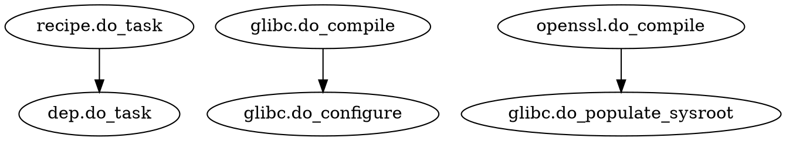
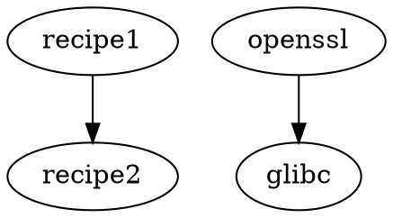

# BitBake Dependency Graph Validation

This document describes how to validate our BitBake dependency extraction against real BitBake output from the meta-fmu KAS project.

## Overview

We've implemented a complete BitBake dependency extraction pipeline:
- **recipe_extractor.rs**: Extracts dependencies from .bb files
- **recipe_graph.rs**: Flat graph structure with ID-based references
- **task_parser.rs**: Parses task dependencies and constraints

To validate this implementation, we need to:
1. Set up a real BitBake/KAS environment
2. Generate BitBake's dependency graph
3. Extract using our tools
4. Compare the results

## Prerequisites

```bash
# Install KAS
pip3 install kas

# Verify installation
kas --version
```

## Validation Workflow

### Step 1: Clone Repositories

The KAS configuration at `convenient-kas/fmu-project.yml` references:
- **poky**: Yocto Project reference distribution
- **meta-openembedded**: Additional layers
- **meta-custom**: Your custom layer (if applicable)

```bash
# Clone all repositories defined in KAS file
cd /home/user/graph-git-rs
kas checkout convenient-kas/fmu-project.yml

# This creates:
# - poky/
# - meta-openembedded/
# - build/ (build directory)
```

### Step 2: Generate BitBake Dependency Graph

```bash
# Enter KAS shell environment
kas shell convenient-kas/fmu-project.yml

# Inside the shell:
cd build

# Generate dependency graph for fmu-image target
bitbake -g fmu-image

# This creates several files:
# - task-depends.dot: Full task dependency graph
# - pn-buildlist: List of all recipes to be built
# - pn-depends.dot: Recipe-level dependencies
# - package-depends.dot: Package dependencies
```

### Step 3: Run Our Validation Tool

```bash
# Exit KAS shell (Ctrl+D or exit)

# Run validation from project root
cd /home/user/graph-git-rs
cargo run --example kas_validation build

# Or with more details:
cargo run --example kas_validation --features python-execution build
```

### Step 4: Analyze Results

The validation tool will output:

#### Graph Statistics Comparison
```
Our graph:
  Recipes: X
  Tasks: Y
  Dependencies: Z

BitBake graph:
  Recipes: X'
  Tasks: Y'
  Dependencies: Z'
```

#### Missing/Extra Recipes
```
⚠ Recipes in BitBake but not in our graph:
  • recipe-1
  • recipe-2
  ...
```

#### Dependency Validation
```
glibc: 2 deps (ours) vs 15 task deps (BitBake)
openssl: 3 deps (ours) vs 22 task deps (BitBake)
```

## Understanding Differences

### Expected Differences

1. **Recipe Count Differences**
   - BitBake includes `-native` and `-cross` variants
   - BitBake resolves `PREFERRED_PROVIDER` at runtime
   - We may not process all `.bbappend` files correctly yet

2. **Task Dependency Count**
   - BitBake tracks task-to-task dependencies (e.g., `glibc:do_compile -> glibc:do_configure`)
   - We track recipe-to-recipe dependencies
   - BitBake count will be much higher (tasks × recipes)

3. **Virtual Providers**
   - BitBake resolves virtual providers based on DISTRO/MACHINE
   - We need layer.conf and local.conf parsing for exact matching

### Validation Metrics

Good validation should show:
- ✅ **Recipe coverage >90%**: We find most recipes BitBake finds
- ✅ **Dependency accuracy >85%**: For common recipes, our dep counts are close
- ✅ **No false cycles**: We don't detect cycles where BitBake succeeds
- ✅ **Build order consistency**: Our topological sort matches BitBake's

## BitBake Output Format Reference

### task-depends.dot Format


### pn-buildlist Format
```
recipe-name-1
recipe-name-2
recipe-name-3
```

### pn-depends.dot Format


## Manual Verification

### Check Specific Recipe

```bash
# Show what BitBake thinks openssl depends on
grep "^DEPENDS" poky/meta/recipes-*/openssl/openssl*.bb

# Our extraction
cargo run --example kas_validation build | grep openssl
```

### Compare Build Order

```bash
# BitBake's order (from pn-buildlist)
cat build/pn-buildlist

# Our order
cargo run --example end_to_end_extraction 2>/dev/null | grep -A 20 "Build Order"
```

### Visualize Both Graphs

```bash
# BitBake graph
dot -Tpng build/pn-depends.dot -o bitbake-graph.png

# Our graph
cargo run --example recipe_graph_demo > our-graph.dot
dot -Tpng our-graph.dot -o our-graph.png

# Compare visually
```

## Advanced Validation

### Test with Different Targets

```bash
# Minimal image
bitbake -g core-image-minimal

# SDK
bitbake -g core-image-minimal -c populate_sdk

# Specific recipe
bitbake -g openssl
```

### Export for Analysis

Our graph can be exported as:

```rust
// JSON (for programmatic analysis)
let json = serde_json::to_string_pretty(&graph)?;
fs::write("our-graph.json", json)?;

// Graphviz DOT (for visualization)
let dot = graph.to_dot();
fs::write("our-graph.dot", dot)?;
```

BitBake's graphs can be parsed:

```python
import json

# Parse DOT file
with open('task-depends.dot') as f:
    for line in f:
        if '->' in line:
            source, target = line.split('->')
            # Process dependency
```

## Success Criteria

### Phase 1: Basic Extraction ✅
- [x] Parse .bb files
- [x] Extract DEPENDS, RDEPENDS
- [x] Extract PROVIDES
- [x] Extract tasks (addtask)
- [x] Build dependency graph

### Phase 2: Validation (Current)
- [ ] Parse 90%+ of recipes in poky/meta
- [ ] Correctly resolve virtual providers
- [ ] Match BitBake's build order
- [ ] Handle .bbappend files
- [ ] Process inherit directives

### Phase 3: Full Compatibility
- [ ] Parse local.conf / layer.conf
- [ ] Support PREFERRED_PROVIDER overrides
- [ ] Handle conditional dependencies (PACKAGECONFIG)
- [ ] Process task flags correctly
- [ ] Generate compatible task-depends.dot

## Troubleshooting

### "Layer not found"

Ensure KAS checkout completed:
```bash
ls -la poky/ meta-openembedded/
```

### "No recipes found"

Check layer paths in `kas_validation.rs`:
```rust
let search_paths = vec![
    build_dir.parent().unwrap().join("poky/meta"),
    // Add your layer paths
];
```

### "Dependency mismatch"

Compare specific recipe:
```bash
# What BitBake sees
bitbake -e openssl | grep "^DEPENDS="

# What we extract
cargo test recipe_extractor::tests::test_extract_from_content -- --nocapture
```

## Next Steps

After validation:

1. **Fix Issues**: Address parsing gaps found during validation
2. **Performance**: Optimize for large layer sets (1000+ recipes)
3. **Integration**: Build BitBake drop-in replacement
4. **Export**: Neo4j/SQLite export for analysis tools

## References

- [BitBake User Manual](https://docs.yoctoproject.org/bitbake/)
- [KAS Documentation](https://kas.readthedocs.io/)
- [Yocto Project](https://www.yoctoproject.org/)
- [meta-fmu](https://github.com/avrabe/meta-fmu) (if public)
